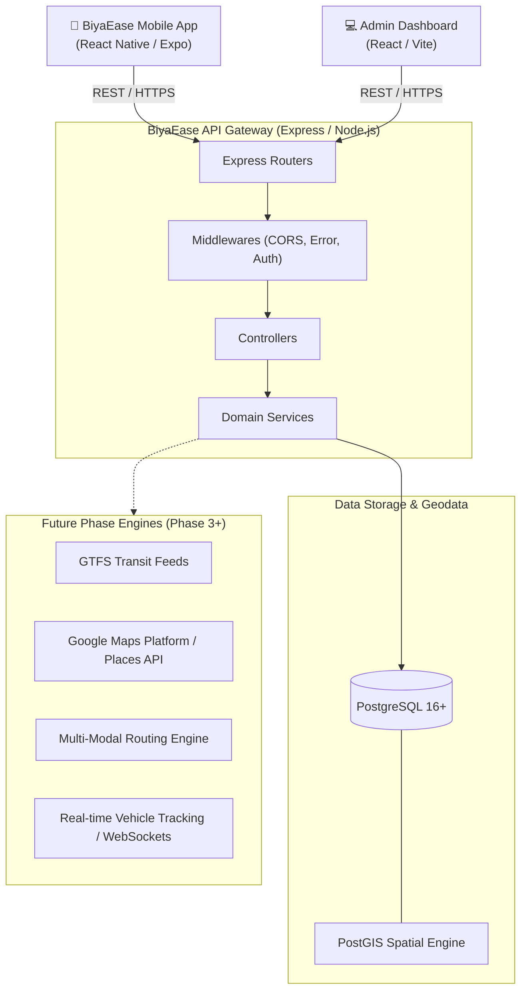

# BiyaEase Architecture Documentation

BiyaEase is a comprehensive Philippine public transportation and commute navigation platform designed to simplify daily commutes across jeepneys, UV Express, buses, MRT/LRT rail, tricycles, and walking paths.

---

## 1. System Overview



---

## 2. Layered Architecture Pattern

The backend strictly implements clean separation of concerns:

```
Route (Request Routing & URL Mapping)
  └── Controller (HTTP Parsing, Status Codes, Input Validation)
        └── Service (Pure Business Logic & Domain Algorithms)
              └── Database / Data Access (PostgreSQL / PostGIS Queries)
```

- **Routes (`server/src/routes/`)**: Map URI patterns and HTTP verbs to controller methods. No business logic is placed directly in route definitions.
- **Controllers (`server/src/controllers/`)**: Handle incoming HTTP requests, extract parameters, invoke domain services, and return standard JSON responses.
- **Services (`server/src/services/`)**: Encapsulate pure business logic, calculations, route analysis, and transit data orchestration.
- **Database (`server/src/database/`)**: Manage connection pooling (`pg`), PostGIS queries, parameterized SQL execution, and migrations.

---

## 3. Technology Stack

| Layer               | Technology                     | Purpose                                                     |
| ------------------- | ------------------------------ | ----------------------------------------------------------- |
| **Mobile Client**   | React Native, Expo, TypeScript | Cross-platform commuter application (iOS & Android)         |
| **Admin Dashboard** | React, Vite, TypeScript        | Internal transit data & community reports management        |
| **Backend API**     | Node.js, Express, TypeScript   | Scalable REST API gateway & service layer                   |
| **Database**        | PostgreSQL, PostGIS            | Relational storage & geospatial indexing for transit routes |
| **Infrastructure**  | Railway                        | Containerized cloud deployment                              |
| **Package Manager** | npm (Workspaces)               | Monorepo package management                                 |

---

## 4. Phase Roadmap

```
PHASE 0: Project Foundation (Current)
└── Monorepo setup, server scaffolding, health check, DB connector, TypeScript & linting.

PHASE 1: UI/UX Foundation
└── Mobile UI screens with mock data (Splash, Onboarding, Home, Search, Route Options, Details, Nav shell).

PHASE 2: Database
└── PostgreSQL schema, PostGIS geometry types, migrations for stops, routes, fares, and schedules.

PHASE 3: GTFS Importer
└── Import, parse, and validate Philippine GTFS feeds and transit schedule data.

PHASE 4: Map System
└── Interactive vector maps integration (Google Maps SDK for React Native).

PHASE 5: Location Search
└── Place autocomplete, geocoding, and landmark search via Google Places API.

PHASE 6: Routing Engine
└── Multi-modal pathfinding algorithm (walking + jeepney + bus + train + UV express).

PHASE 7: Route Options
└── Compare commute routes based on travel time, fare cost, transfer count, and walking distance.

PHASE 8: Route Details
└── Step-by-step turn/transfer instructions, boarding points, landmark hints, and fare breakdown.

PHASE 9: Navigation
└── Active trip guidance, turn-by-turn alerts, and alight/transfer notifications.

PHASE 10: Saved Places
└── Bookmark frequently visited locations (Home, Work, School, Favorites).

PHASE 11: Authentication
└── User registration, login, secure session tokens (JWT), and profile management.

PHASE 12: Community Reports
└── Commuter crowdsourced reports (traffic delays, broken trains, fare changes, long queues).

PHASE 13: Admin Dashboard
└── Web interface for system analytics, commuter metrics, and data moderation.

PHASE 14: Transit Data Management
└── Admin tools to edit routes, stops, schedules, and fare matrices.

PHASE 15: Real-Time Vehicles
└── Live vehicle GPS tracking, estimated arrival times (ETA), and WebSockets.

PHASE 16: Security + Performance
└── Rate limiting, query optimization, spatial indexing, caching (Redis), penetration testing.

PHASE 17: Testing
└── Comprehensive unit, integration, end-to-end (E2E), and load testing.

PHASE 18: Production Deployment
└── CI/CD pipeline, Railway staging/production environments, domain setup, monitoring.
```

---

## 5. Security & Deployment Foundation

- **Secrets Management**: No credentials in source control; `.env` is git-ignored and configured through Railway environment variables.
- **Strict Parameterization**: All SQL queries use prepared statements.
- **Controlled CORS**: Restricted in production to whitelisted client domains.
- **Fail-Safe Health Checks**: Dedicated `/api/health` endpoint for infrastructure probes.
