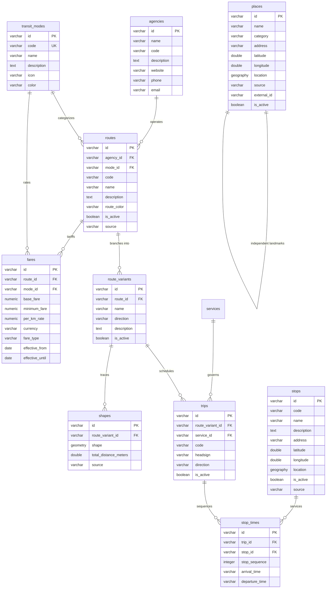

# BiyaEase Database Documentation — Phase 2: Database Foundation

This document defines the PostgreSQL + PostGIS database architecture, schema definitions, spatial indexing, GTFS crosswalk, and development workflows for **BiyaEase** — the Philippine commute navigation system.

---

## 1. Overview & Technology Stack

- **Database**: PostgreSQL 15+ / 16+
- **Spatial Extension**: PostGIS 3.x (`CREATE EXTENSION IF NOT EXISTS postgis;`)
- **Spatial Reference System (SRID)**: `SRID 4326` (WGS 84 coordinate system)
- **Spatial Data Types**:
  - `GEOGRAPHY(Point, 4326)` for physical stops, stations, and landmark places (enables fast spherical distance calculations in meters).
  - `GEOMETRY(LineString, 4326)` for transit route corridor paths and vehicle trajectories.
- **Data Access**: Parameterized queries using native `pg` client pool with PostGIS spatial functions (`ST_DWithin`, `ST_Distance`, `ST_AsGeoJSON`, `ST_SetSRID`, `ST_MakePoint`).

---

## 2. Entity-Relationship Architecture



---

## 3. Table Schemas & Definitions

### 3.1 `agencies`

Transit operators, government regulatory boards, or transport cooperatives.

- `id` (VARCHAR(64), PK): Unique agency ID (e.g. `agency-ltfrb`, `agency-mrtc`).
- `name` (VARCHAR(255), NOT NULL): Agency name (e.g. _"Land Transportation Franchising and Regulatory Board"_).
- `code` (VARCHAR(64), UNIQUE): Short code (e.g. `LTFRB`, `MRTC`, `LRMC`, `MMDA`).
- `description`, `website`, `phone`, `email`
- `created_at`, `updated_at`: TIMESTAMPTZ

### 3.2 `transit_modes`

Transportation modes operating in the Philippine transit ecosystem.

- `id` (VARCHAR(64), PK)
- `code` (VARCHAR(64), UNIQUE, NOT NULL): `jeepney`, `bus`, `mrt`, `lrt`, `uv_express`, `tricycle`, `walking`.
- `name` (VARCHAR(128), NOT NULL): Display name.
- `description`, `icon`, `color`: Brand color hex code (e.g. `#F59E0B` for Jeepney, `#7C3AED` for MRT).

### 3.3 `services`

GTFS-compatible calendar schedule rules determining operational days.

- `id` (VARCHAR(64), PK): (e.g. `service-daily`, `service-weekday`).
- `code` (VARCHAR(64), UNIQUE, NOT NULL)
- `monday` .. `sunday` (BOOLEAN, NOT NULL DEFAULT TRUE)
- `start_date`, `end_date` (DATE)

### 3.4 `routes`

Logical transit corridors/lines.

- `id` (VARCHAR(64), PK): Unique route ID (e.g. `route-jeep-05`, `route-mrt-3`).
- `agency_id` (VARCHAR(64), FK → `agencies.id` ON DELETE SET NULL)
- `mode_id` (VARCHAR(64), FK → `transit_modes.id` ON DELETE RESTRICT)
- `code` (VARCHAR(64), NOT NULL): Route signage code (e.g. `JEEP-05`, `MRT-3`, `BUS-EDSA`).
- `name` (VARCHAR(255), NOT NULL): Route name (e.g. _"UP Campus - Philcoa"_).
- `route_color` (VARCHAR(32)): Visual line color.
- `is_active` (BOOLEAN, DEFAULT TRUE)
- `source` (VARCHAR(64), DEFAULT `'biyaease'`)

### 3.5 `route_variants`

Directional branches of a route.

- `id` (VARCHAR(64), PK)
- `route_id` (VARCHAR(64), FK → `routes.id` ON DELETE CASCADE)
- `name` (VARCHAR(255), NOT NULL): e.g. _"UP Campus to Philcoa"_.
- `direction` (VARCHAR(32), NOT NULL): `outbound`, `inbound`, `northbound`, `southbound`, `eastbound`, `westbound`.
- `is_active` (BOOLEAN, DEFAULT TRUE)

### 3.6 `stops`

Physical passenger boarding and alighting locations.

- `id` (VARCHAR(64), PK)
- `code` (VARCHAR(64)): Station code (e.g. `MRT3-01`, `STP-UP-01`).
- `name` (VARCHAR(255), NOT NULL): e.g. _"North Avenue MRT-3 Station"_.
- `latitude` (DOUBLE PRECISION, NOT NULL): WGS84 Latitude Y.
- `longitude` (DOUBLE PRECISION, NOT NULL): WGS84 Longitude X.
- `location` (**GEOGRAPHY(Point, 4326)**, NOT NULL): Primary spatial source of truth.
- `address`, `description`, `is_active`, `source`

### 3.7 `trips`

Operating schedule instances for route variants.

- `id` (VARCHAR(64), PK)
- `route_variant_id` (VARCHAR(64), FK → `route_variants.id` ON DELETE CASCADE)
- `service_id` (VARCHAR(64), FK → `services.id` ON DELETE SET NULL)
- `headsign` (VARCHAR(255), NOT NULL): Sign displayed on vehicle (e.g. _"Taft Avenue via EDSA"_).
- `direction` (VARCHAR(32))

### 3.8 `stop_times`

Ordered sequence linking trips to stops.

- `id` (VARCHAR(64), PK)
- `trip_id` (VARCHAR(64), FK → `trips.id` ON DELETE CASCADE)
- `stop_id` (VARCHAR(64), FK → `stops.id` ON DELETE RESTRICT)
- `stop_sequence` (INTEGER, NOT NULL CHECK > 0): 1-indexed order along route.
- `arrival_time`, `departure_time` (VARCHAR(16))
- **Constraint**: `UNIQUE (trip_id, stop_sequence)`

### 3.9 `shapes`

Geographic LineString geometry of the route corridor.

- `id` (VARCHAR(64), PK)
- `route_variant_id` (VARCHAR(64), FK → `route_variants.id` ON DELETE CASCADE)
- `shape` (**GEOMETRY(LineString, 4326)**, NOT NULL): PostGIS LineString geometry.
- `total_distance_meters` (DOUBLE PRECISION)

### 3.10 `places`

Searchable landmarks, universities, shopping malls, government centers, and terminals.

- `id` (VARCHAR(64), PK): (e.g. `place-sm-north`, `place-up-diliman`).
- `name` (VARCHAR(255), NOT NULL)
- `category` (VARCHAR(64)): `mall`, `university`, `transit_hub`, `government`, `landmark`, `commercial`.
- `latitude`, `longitude` (DOUBLE PRECISION)
- `location` (**GEOGRAPHY(Point, 4326)**, NOT NULL)
- `external_id` (VARCHAR(255)): Identifier for Google Places or OpenStreetMap cross-referencing.

### 3.11 `fares`

Philippine transit fare matrices.

- `id` (VARCHAR(64), PK)
- `route_id` (VARCHAR(64), FK → `routes.id` ON DELETE CASCADE)
- `mode_id` (VARCHAR(64), FK → `transit_modes.id` ON DELETE RESTRICT)
- `base_fare` (NUMERIC(8, 2), NOT NULL): Base boarding fare in PHP (₱).
- `minimum_fare` (NUMERIC(8, 2), NOT NULL)
- `per_km_rate` (NUMERIC(8, 2), DEFAULT 0.00)
- `currency` (VARCHAR(8), DEFAULT `'PHP'`)
- `fare_type` (VARCHAR(32), DEFAULT `'regular'`)
- `effective_from` (DATE), `effective_until` (DATE)

---

## 4. PostGIS Spatial Indexing

Spatial indexes are created using **GIST (Generalized Search Tree)** for logarithmic spatial lookup performance:

```sql
CREATE INDEX IF NOT EXISTS idx_stops_location_gist ON stops USING GIST (location);
CREATE INDEX IF NOT EXISTS idx_places_location_gist ON places USING GIST (location);
CREATE INDEX IF NOT EXISTS idx_shapes_shape_gist ON shapes USING GIST (shape);
```

---

## 5. GTFS Crosswalk

The BiyaEase schema maps cleanly to standard GTFS feed specifications:

| GTFS Specification File | BiyaEase Database Table    | Notes                                             |
| ----------------------- | -------------------------- | ------------------------------------------------- |
| `agency.txt`            | `agencies`                 | Operator & contact info                           |
| `routes.txt`            | `routes`                   | Lines, modes, and colors                          |
| `stops.txt`             | `stops`                    | Geographic coordinates & `GEOGRAPHY(Point, 4326)` |
| `trips.txt`             | `trips` & `route_variants` | Directional trips & variants                      |
| `stop_times.txt`        | `stop_times`               | Sequenced stops with sequence constraint          |
| `calendar.txt`          | `services`                 | Days of week operating schedules                  |
| `shapes.txt`            | `shapes`                   | Converted to single `GEOMETRY(LineString, 4326)`  |
| `fare_attributes.txt`   | `fares`                    | Matrix & per-km pricing in PHP (₱)                |

---

## 6. Example Spatial Queries

### 6.1 Finding Nearby Stops Within 500 Meters

```sql
SELECT
  id,
  name,
  latitude,
  longitude,
  ROUND(ST_Distance(location, ST_SetSRID(ST_MakePoint(121.0283, 14.6569), 4326)::geography)::numeric, 1) AS distance_meters
FROM stops
WHERE is_active = true
  AND ST_DWithin(location, ST_SetSRID(ST_MakePoint(121.0283, 14.6569), 4326)::geography, 500)
ORDER BY distance_meters ASC;
```

### 6.2 Retrieving Route LineString Shape as GeoJSON

```sql
SELECT
  id,
  route_variant_id,
  total_distance_meters,
  ST_AsGeoJSON(shape) AS geojson
FROM shapes
WHERE route_variant_id = 'var-mrt-3-south';
```

### 6.3 Querying Sequenced Stops for a Route Variant

```sql
SELECT
  s.id,
  s.name,
  s.latitude,
  s.longitude,
  st.stop_sequence,
  st.arrival_time
FROM trips t
JOIN stop_times st ON st.trip_id = t.id
JOIN stops s ON s.id = st.stop_id
WHERE t.route_variant_id = 'var-jeep-05-out'
ORDER BY st.stop_sequence ASC;
```

---

## 7. Migration & Seeding CLI Commands

| Command              | Purpose                                                                                                   |
| -------------------- | --------------------------------------------------------------------------------------------------------- |
| `npm run db:migrate` | Runs all pending SQL migrations in `server/src/database/migrations/` sequentially inside transactions.    |
| `npm run db:seed`    | Populates verified Metro Manila seed datasets (MRT-3, LRT-2, EDSA Busway, UP Jeepneys, landmarks, fares). |
| `npm run db:reset`   | Drops all transit tables and re-executes all migrations from scratch for clean local testing.             |
| `npm run db:postgis` | Tests PostgreSQL connectivity and outputs PostGIS extension version string.                               |
